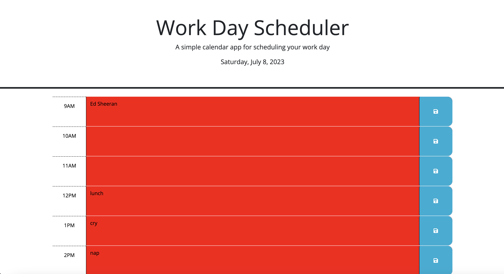
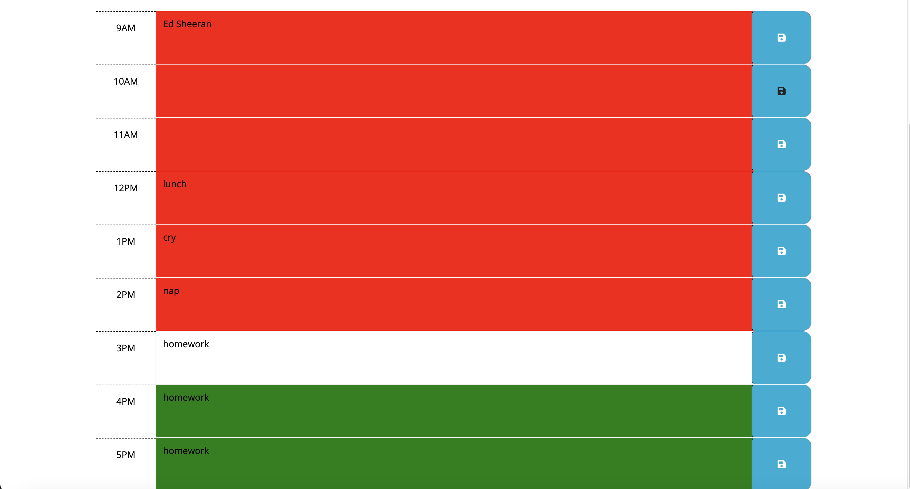

# Challenge 5 Day Planner

## Description

This is a daily planner for the hours between 0900 - 1700 (9AM - 5PM). Each hour is linked to the dayjs calendar server and updates to the current date and time. When an hour is now in the past the block is color coded to red. If it is the current hour the hour is white. If the hour is in the future it is set to green. Each hour features a seperate save button that saves any entries into the planner block to local storage. The button is found on the right side of the entry block. 

This planner is a great and useful tool for those that have constantly changing and shifting schedules throughout the day. 

## Installation

1- The only installation required is installing package.json using the "npm init -y" command in the console. 
2- Then you will be required to enter the following into the bottom of your package.json file.
 "dependencies": {
    "dayjs": "^1.11.9"
  }
3- Then finally you will enter "npm install" into your command to install the dayjs server. 

# Usage

As mentioned above, the usage is really quite simple. Enter your scheduled events into the middle color coded blocks and then save them using the save button found to the right of each block. The button has the typical floppy disc save icon on it. The events are saved into local storage and will be deleted if you are to clear your cache and you will not be able to access events saved onto another computer or device. 

To add a screenshot, create an `assets/images` folder in your repository and upload your screenshot to it. Then, using the relative filepath, add it to your README using the following syntax:

   
    
    

    
    
    

    
    
    

## Credits

Sam Stikeleather

